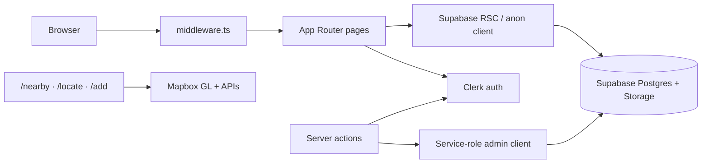

# ManaGo

Find nearby public amenities in Singapore — water coolers, toilets with bidets,
and nursing rooms. Browse them on a map, get walking directions, leave reviews,
and contribute new places.

## Tech stack

| Layer | Choice |
|-------|--------|
| App | Next.js 16 (App Router) + React 19 + TypeScript |
| UI | Tailwind CSS 4 + shadcn/ui |
| Auth | Clerk |
| Data | Supabase (Postgres + Storage) |
| Maps | Mapbox GL JS (+ Geocoding / Directions APIs) |
| Hosting | Vercel + GitHub Actions CI |

## Setup

Needs **Node.js 22+** and **npm 11**. Use `package-lock.json` only.

1. Copy `.env.example` → `.env.local` and fill in the values.
2. Install and run:

```bash
npm ci
npm run dev
```

Open [http://localhost:3000](http://localhost:3000). You’ll land on `/nearby`.

Without Supabase credentials the app still starts, but the facility list is empty.

## Commands

| Command | Purpose |
|---------|---------|
| `npm run dev` | Local development |
| `npm run ci` | Lint + type-check + production build (same as GitHub Actions) |
| `npm run lighthouse` | Performance audit of `/sign-in` and `/help` |
| `npm run seed` | Load `data/facilities.json` into Supabase |
| `npm run clean-data` / `prune-data` | Dataset tidy-up helpers |
| `npm run scrape-photos` / `upload-photos` | Demo facility photos → Supabase Storage |
| `npm run gallery` | Capture framed UI screenshots into `public/gallery/` |
| `npm run thumbnail` | Build `public/devpost-thumbnail.png` |

Seeding and server writes need `SUPABASE_SERVICE_ROLE_KEY` in `.env.local`.
Before a public launch, run `supabase/housekeeping_secure.sql` so the anon key is read-only.

## Folder structure

```
manago/
├─ .github/workflows/   CI (lint, typecheck, build, Lighthouse)
├─ data/                Seed dataset + photo URL manifest
├─ docs/deployment.md   Vercel / Clerk / Supabase checklist
├─ public/              Static assets, gallery screenshots
├─ scripts/             Seed, photos, gallery tooling
├─ supabase/            setup.sql + housekeeping_secure.sql
└─ src/
   ├─ app/              Routes, pages, server actions
   ├─ components/       Shared UI (nav, auth shell, shadcn)
   ├─ lib/              Clerk, Supabase, Mapbox helpers, validation
   ├─ types/            Facility, review, profile, submission
   └─ middleware.ts     Clerk auth gate + `/` redirect
```

## Architecture



- **Browse** uses the anon / cookie Supabase clients (read).
- **Writes** (contribute, reviews, profile sync, admin) go through server actions
  that check Clerk, then use the service-role client.
- **Maps** talk to Mapbox from the browser with the public token.

## Routes and user flows

| Route | Who | What |
|-------|-----|------|
| `/` | Anyone | Redirect → `/nearby` (signed in) or `/sign-in` |
| `/nearby` | Anyone | Map + list of amenities; filter by type |
| `/facilities/[id]` | Anyone | Detail, reviews, navigate / review CTAs |
| `/facilities/[id]/review` | Signed in | Leave a review (aliases hide real names) |
| `/locate` | Anyone | Walking directions to a facility |
| `/add` | Signed in | Contribute a new place (admin reviews it) |
| `/admin/submissions` | Admin | Approve / reject contributions |
| `/profile` | Anyone* | Account entry / profile |
| `/help` | Anyone | FAQ |
| `/sign-in`, `/register` | Anyone | Clerk auth (`/sign-up` redirects to `/register`) |
| `/sign-out` | Anyone | Hard sign-out helper |

\*Profile UI is public-routed; signed-in features need Clerk.

**Typical flows**

1. **Find & go** — `/nearby` → pick pin/card → `/facilities/[id]` → `/locate`
2. **Review** — facility detail → `/facilities/[id]/review` (sign in if needed)
3. **Contribute** — `/add` → pending submission → admin `/admin/submissions`
4. **Account** — `/register` or `/sign-in` → `/nearby` / `/profile`

## Deploy

GitHub Actions runs CI on every PR and on `main`. Vercel deploys previews and
production from `main`. Full checklist (env vars, Clerk origins, Deployment
Protection, photos, rollback): **[docs/deployment.md](docs/deployment.md)**.
