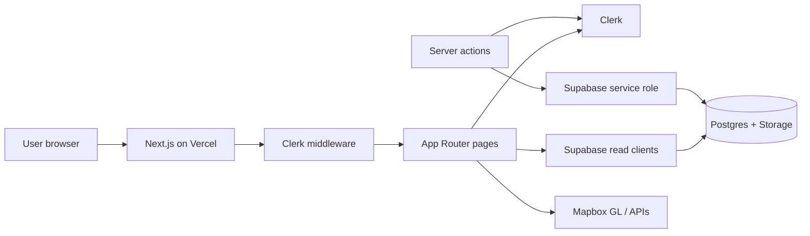

# ManaGo

Find nearby public amenities in Singapore — water coolers, toilets with bidets,
and nursing rooms. Browse them on a map, get walking directions, leave reviews,
and contribute new places.

| | |
|---|---|
| **Live app** | [https://manago-psi.vercel.app](https://manago-psi.vercel.app) |
| **Source** | [https://github.com/alanantony24/manago](https://github.com/alanantony24/manago) (public) |

Start browsing at [`/nearby`](https://manago-psi.vercel.app/nearby).

---

## Tech stack (what we use and why)

| Layer | Technology | Role in ManaGo |
|-------|------------|----------------|
| Framework | **Next.js 16** (App Router) + **React 19** + **TypeScript** | Server-rendered pages, file-based routes, React Server Components, and typed server actions for secure writes |
| Styling | **Tailwind CSS 4** + **shadcn/ui** (Radix) | Utility-first layout and accessible UI primitives (buttons, inputs, toasts) |
| Auth | **Clerk** | Sign-in / register / session; protects `/add` and `/admin/*` via middleware |
| Database & files | **Supabase** (Postgres + Storage) | Facility / review / submission / profile data; amenity photos in Storage |
| Maps | **Mapbox GL JS** + Geocoding / Directions | Interactive map on `/nearby`, turn-by-turn on `/locate`, address search on `/add` |
| Hosting & CI | **Vercel** + **GitHub Actions** | Cloud deploy from `main`; CI runs lint, type-check, build, and Lighthouse |

**How the pieces connect**

1. The browser hits Next.js on Vercel.
2. `middleware.ts` uses Clerk to allow public browsing and require login for contribute/admin.
3. Pages **read** facilities through the Supabase anon / RSC clients.
4. Server actions **write** (reviews, submissions, profile sync, admin approve) only after a Clerk check, using the Supabase **service role** key (never exposed to the browser).
5. Mapbox tokens stay public but should be restricted to your domains.



---

## Run locally

### Requirements

- **Node.js 22+** and **npm 11** (see `packageManager` in `package.json`)
- Accounts / keys for **Supabase**, **Clerk**, and **Mapbox** (same services as production)
- Use **`package-lock.json` only** (`npm ci`)

### 1. Clone and install

```bash
git clone https://github.com/alanantony24/manago.git
cd manago
npm ci
```

### 2. Environment variables

Copy the example env file and fill in real values:

```bash
cp .env.example .env.local
```

| Variable | Required for | Notes |
|----------|--------------|-------|
| `NEXT_PUBLIC_SUPABASE_URL` | Listing facilities | Supabase project URL |
| `NEXT_PUBLIC_SUPABASE_ANON_KEY` | Listing facilities | Public anon key (read after RLS lockdown) |
| `NEXT_PUBLIC_MAPBOX_ACCESS_TOKEN` | Map / directions / geocode | Public token; restrict by URL in Mapbox |
| `NEXT_PUBLIC_CLERK_PUBLISHABLE_KEY` | Auth UI | From Clerk dashboard |
| `CLERK_SECRET_KEY` | Auth / middleware | Server only — never commit |
| `SUPABASE_SERVICE_ROLE_KEY` | Seed, contribute, reviews, admin | Server only — never commit or put in client code |

Optional Clerk path hints (defaults match the app):

```env
NEXT_PUBLIC_CLERK_SIGN_IN_URL=/sign-in
NEXT_PUBLIC_CLERK_SIGN_UP_URL=/register
NEXT_PUBLIC_CLERK_SIGN_IN_FALLBACK_REDIRECT_URL=/nearby
NEXT_PUBLIC_CLERK_SIGN_UP_FALLBACK_REDIRECT_URL=/nearby
```

In the **Clerk** dashboard, add `http://localhost:3000` under allowed origins / redirect URLs.

### 3. Start the app

```bash
npm run dev
```

Open [http://localhost:3000](http://localhost:3000). You should land on `/nearby`.

Without Supabase credentials the app still starts, but the facility list is empty.

### 4. Optional: seed data and photos

If your Supabase project is empty or you want to refresh demo data:

```bash
# Optional helper column for upserts (not a full schema migration)
# Run supabase/setup.sql in the Supabase SQL editor if needed.

npm run upload-photos   # demo photos → Storage
npm run seed            # data/facilities.json → facilities table
```

Before treating an environment as public, run `supabase/housekeeping_secure.sql` so the anon key cannot write tables/storage.

### Useful local commands

| Command | Purpose |
|---------|---------|
| `npm run dev` | Development server |
| `npm run build` / `npm start` | Production build locally |
| `npm run ci` | Lint + type-check + build (same checks as GitHub Actions) |
| `npm run lighthouse` | Lighthouse CI against `/sign-in` and `/help` |
| `npm run seed` | Load `data/facilities.json` into Supabase |
| `npm run clean-data` / `prune-data` | Dataset cleanup helpers |
| `npm run scrape-photos` / `upload-photos` | Demo photos pipeline |
| `npm run gallery` | Capture framed UI screenshots → `public/gallery/` |
| `npm run thumbnail` | Build `public/devpost-thumbnail.png` |

---

## Deploy to the cloud (Vercel)

Production is already hosted at **[https://manago-psi.vercel.app](https://manago-psi.vercel.app)**.
To deploy your own copy (or re-link the repo):

### 1. Push to GitHub

This repo is public: [alanantony24/manago](https://github.com/alanantony24/manago).
GitHub Actions runs **Quality, build, and performance** on PRs and on `main`.

### 2. Create a Vercel project

1. Import the GitHub repo in [Vercel](https://vercel.com) as a **Next.js** project.
2. Set the production branch to **`main`**.
3. Add environment variables for **Preview** and **Production**:

| Variable | On Vercel | On GitHub Actions |
|----------|-----------|-------------------|
| `NEXT_PUBLIC_SUPABASE_URL` | Yes | Yes (repo **variable**) |
| `NEXT_PUBLIC_SUPABASE_ANON_KEY` | Yes | Yes (**secret**) |
| `NEXT_PUBLIC_MAPBOX_ACCESS_TOKEN` | Yes | Yes (**secret**) |
| `NEXT_PUBLIC_CLERK_PUBLISHABLE_KEY` | Yes | Yes (**secret**) |
| `CLERK_SECRET_KEY` | Yes | Yes (**secret**) |
| `SUPABASE_SERVICE_ROLE_KEY` | Yes (server only) | **No** — never put this in CI |

4. Deploy. Vercel will build on every push to `main` and create preview URLs for PRs.

### 3. Wire Clerk and Mapbox to the live domain

1. **Vercel → Settings → Deployment Protection** → set Production to **None**.  
   If SSO protection stays on, anonymous visitors (and graders) cannot open the site, and Clerk forms often fail.
2. **Clerk** → allow `https://manago-psi.vercel.app` (and any custom domain) plus `http://localhost:3000`.  
   Sign-in path: `/sign-in`. Sign-up path: `/register`.
3. **Mapbox** → restrict the public token to those same domains.
4. **Supabase** → run `housekeeping_secure.sql` once if you have not already locked down RLS.

### 4. Verify production

- [ ] `https://manago-psi.vercel.app/nearby` loads the map and facilities
- [ ] Sign-in / register works
- [ ] Contribute (`/add`), review, and profile work when signed in
- [ ] `npm run ci` is green on GitHub

More detail (photos, rollback, release checklist): **[docs/deployment.md](docs/deployment.md)**.

---

## Folder structure

```
manago/
├─ .github/workflows/   CI: lint, typecheck, build, Lighthouse
├─ data/                Seed dataset + photo URL manifest
├─ docs/deployment.md   Extended cloud / security / rollback notes
├─ public/              Static assets, gallery screenshots, fallback image
├─ scripts/             Seed, photo, and gallery tooling
├─ supabase/            setup.sql + housekeeping_secure.sql
└─ src/
   ├─ app/              Routes, pages, server actions
   ├─ components/       Shared UI (nav, auth shell, shadcn)
   ├─ lib/              Clerk, Supabase, Mapbox helpers, validation
   ├─ types/            Facility, review, profile, submission
   └─ middleware.ts     Clerk auth gate + `/` redirect
```

---

## Routes and user flows

| Route | Access | Purpose |
|-------|--------|---------|
| `/` | Anyone | Redirect → `/nearby` if signed in, else `/sign-in` |
| `/nearby` | Anyone | Map + list; filter by amenity type |
| `/facilities/[id]` | Anyone | Detail, reviews, navigate / review actions |
| `/facilities/[id]/review` | Signed in | Leave a review (display names are anonymized) |
| `/locate` | Anyone | Walking directions to a facility |
| `/add` | Signed in | Contribute a new place (queued for admin) |
| `/admin/submissions` | Admin role | Approve / reject contributions |
| `/profile` | Public route* | Account / profile entry |
| `/help` | Anyone | FAQ |
| `/sign-in`, `/register` | Anyone | Clerk auth (`/sign-up` → `/register`) |
| `/sign-out` | Anyone | Hard sign-out helper |

\*Routed as public so the page can render; signed-in features still need Clerk.

**Typical flows**

1. **Find & go** — `/nearby` → facility card/pin → `/facilities/[id]` → `/locate`
2. **Review** — facility detail → sign in if needed → `/facilities/[id]/review`
3. **Contribute** — `/add` → pending submission → admin `/admin/submissions`
4. **Account** — `/register` or `/sign-in` → `/nearby` / `/profile`

---

## License / course notes

Built for course submission. Do not commit `.env.local` or service-role keys.
